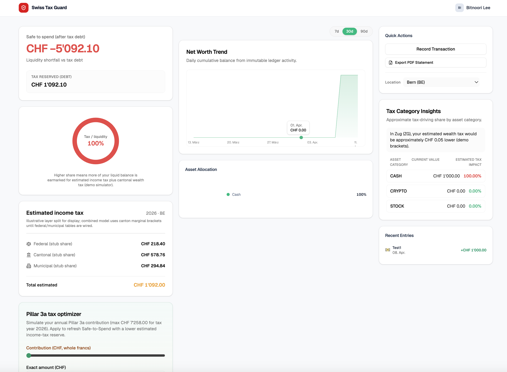
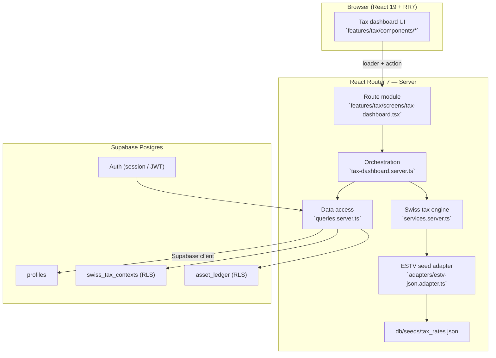
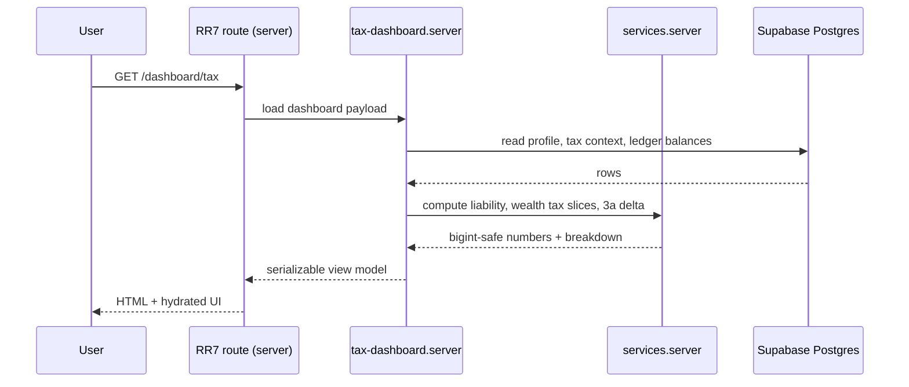

# Swiss Tax Guard (STG)



> **Turning tax debt into spending confidence** — a real-time tax liability and liquidity dashboard for Swiss residents that separates estimated tax from spendable cash.

This repository extends the [Supaplate](https://supaplate.com/docs) stack (React Router 7, Supabase, Drizzle). Product vision and roadmap live in [`PROJECT_PLAN.md`](./PROJECT_PLAN.md). 

Screenshot source file: [`dashboard_example.png`](./dashboard_example.png) (repository root).


---

## Product thesis

| Pillar | What it means |
|--------|----------------|
| **Problem** | Without reliable withholding, people confuse **account balance** with **post-tax disposable liquidity**, which drives year-end cash shocks. |
| **Approach** | Combine ledger balances with **estimated** federal, cantonal, municipal (and optional church) tax to surface **Safe-to-Spend**. |
| **North star** | **Safe-to-Spend accuracy** vs. official assessments — target variance under **2%** (see `PROJECT_PLAN.md`). |


```text
Safe-to-Spend = Total Assets − (Estimated Tax Liability + Safety Buffer)
```

**Precision**: model CHF in **Rappen** (`bigint`, 1 CHF = 100). Format for display in the UI only. Do not use floating-point `number` types for tax or money aggregates.

---

## Architecture

Tax math and persistence run on the **server** (loaders and actions). The browser focuses on presentation and lightweight validation. The canonical tax engine entry point is `app/features/tax/services.server.ts`

### System diagram



### Dashboard request flow



---

## Stack

| Layer | Choice |
|-------|--------|
| Framework | React Router 7 (framework mode), React 19 |
| UI | Tailwind CSS 4, Radix UI, Lucide |
| Data | Supabase (Postgres, Auth), Drizzle ORM, `sql/migrations/` |
| Quality | TypeScript, Playwright (`npm run test:e2e`) |
| Observability / misc | Sentry (when configured), `@react-pdf/renderer` (report paths exist in-repo) |

---

## Repository map (tax feature)

```text
app/features/tax/
  services.server.ts        # Liability, marginal slices, Safe-to-Spend core
  tax-dashboard.server.ts   # Loader orchestration, context sync
  queries.server.ts         # Supabase reads/writes
  schema.ts                 # swiss_tax_contexts (includes RLS policies)
  components/               # Dial, hero, Pillar 3a optimizer, etc.
  adapters/                 # ESTV-oriented seed JSON adapter
app/db/seeds/tax_rates.json
sql/migrations/             # Schema source of truth
sql/snippets/               # RLS reference snippets
```

---

## Implemented vs. planned

Aligned with **Phase 1 — High-precision foundation** and parts of **Phase 2 — Nordic UX and simulators** in `PROJECT_PLAN.md`:

| Area | Status |
|------|--------|
| Schema: `profiles`, `asset_ledger`, `swiss_tax_contexts` | In use with Drizzle and `sql/migrations/` |
| Tax engine (server) | Income (marginal slices), demo-style cantonal wealth tax, ESTV-oriented seeds |
| Dashboard UX | Safe-to-Spend hero and dial, tax breakdown, asset mix, skeleton-friendly flows |
| Scenarios | Pillar **3a** contribution vs. marginal-rate savings estimate |
| Insights | Relocation-style hints (for example Zug wealth tax on the same asset base) |
| E2E | Playwright, including tax-guard flows |

**Still roadmap or partial**: Supabase Vault-style field encryption, full Phase 3 automation (CSV / b.link mocks), complete official assessment parity, and end-to-end compliance PDF reporting.

---

## Getting started

1. **Prerequisites**: Node.js compatible with the repo, a Supabase project, and a Postgres URL for Drizzle migrations.
2. **Environment**: Configure Supabase and database URLs per Supaplate / Supabase docs (local `.env` is gitignored).
3. **Database**: Apply `sql/migrations/`, then run `npm run db:typegen` if you use the Supabase CLI (replace the placeholder project id in `package.json`).
4. **Seed tax data** (when needed):

   ```bash
   npm run db:seed-tax
   ```

5. **Dev server**:

   ```bash
   npm install
   npm run dev
   ```

6. **Quality gates**:

   ```bash
   npm run typecheck
   npm run test:e2e
   ```

**Tax dashboard route**: `/dashboard/tax` — see [`app/routes.ts`](./app/routes.ts) and `features/tax/screens/tax-dashboard.tsx`.

---

## Security and privacy notes

- Production deployments should treat **RLS on all user-owned tables** as mandatory (`sql/snippets/`, Drizzle `pgPolicy` patterns).
- Prefer **zero-PII logging** for operational logs (`AI.md`).

---

## Documentation

- **Product and roadmap**: [`PROJECT_PLAN.md`](./PROJECT_PLAN.md)

## License

See [`LICENSE.md`](./LICENSE.md).
