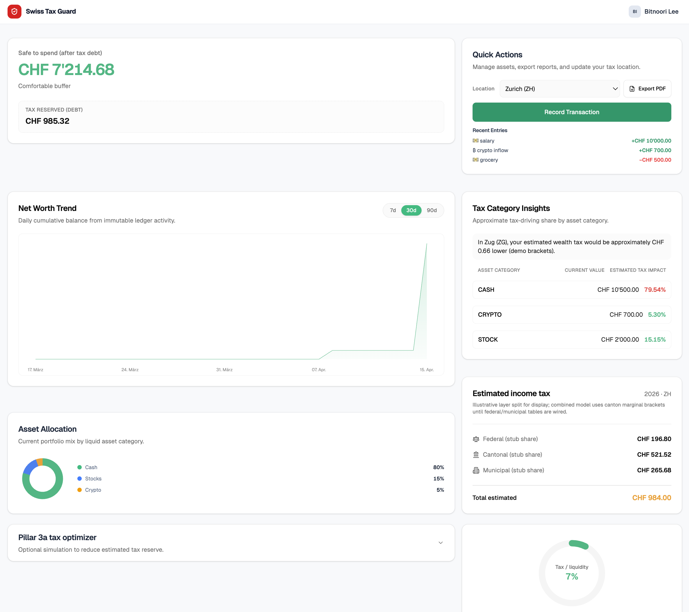
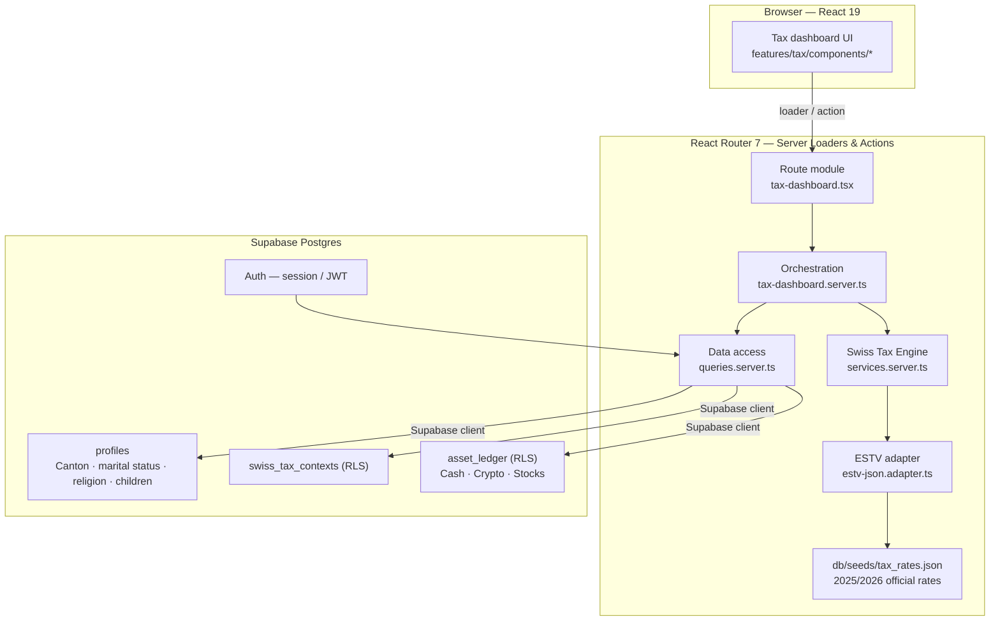
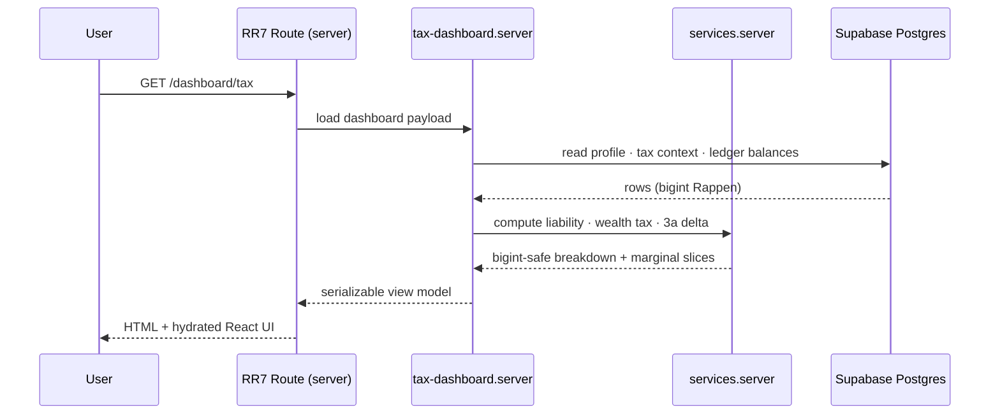

<div align="center">

# Swiss Tax Guard

**Real-time tax liability & liquidity intelligence for Swiss residents**

[](https://www.typescriptlang.org/)
[](https://react.dev/)
[](https://reactrouter.com/)
[](https://supabase.com/)
[](https://tailwindcss.com/)

> *"Turning Tax Debt into Spending Confidence"*

[Overview](#overview) · [Screenshots](#screenshots) · [Architecture](#architecture) · [Tax Engine](#tax-engine) · [Features](#features) · [Getting Started](#getting-started)

</div>

---

## Overview

Swiss Tax Guard solves the **"Money Illusion" problem** unique to Switzerland: unlike most countries, Switzerland does not apply withholding tax at source for self-employed income and capital gains. This means your bank balance always looks better than your *actual* disposable income — until the annual tax bill arrives.

```
Safe-to-Spend = Total Assets − (Estimated Tax Liability + Safety Buffer)
```

The platform gives Swiss residents a real-time, high-precision view of their **truly spendable cash** by continuously estimating federal, cantonal, municipal, and church tax across all 26 cantons — before the official assessment ever lands.

### The Problem Space

| Symptom | Root Cause | STG's Answer |
|---------|------------|--------------|
| Year-end liquidity shocks | Tax liability is invisible until the bill | Real-time running estimate |
| Overspending illusion | Account balance ≠ post-tax disposable income | Isolated `Safe-to-Spend` metric |
| Optimizer paralysis | Pillar 3a savings are hard to quantify | Marginal-rate contribution simulator |
| Canton lock-in | Wealth tax varies 3–6× between cantons | Side-by-side relocation scenario engine |

**North Star Metric**: Safe-to-Spend accuracy vs. official ESTV assessments — target variance **< 2%**.

---

## Screenshots

<figure>
  <figcaption><strong>Command Center Dashboard</strong> — Safe-to-Spend hero, net worth trend, asset allocation, and live tax breakdown.</figcaption>
  
</figure>

<br/>

<figure>
  <figcaption><strong>Pillar 3a Optimizer</strong> — Contribution simulation with marginal-rate tax savings calculation.</figcaption>
  
</figure>

<br/>

<figure>
  <figcaption><strong>Canton Comparison — Zug (ZG)</strong> — Wealth tax and income tax on the same asset base in Switzerland's lowest-tax canton.</figcaption>
  
</figure>

<br/>

<figure>
  <figcaption><strong>Canton Comparison — Zurich (ZH)</strong> — Side-by-side scenario review for relocation decision support.</figcaption>
  
</figure>

---

## Architecture

Tax computation and data persistence live entirely on the **server**. The browser is a pure presentation layer — it receives a serialized view model and handles lightweight UI interactions only.

### System Diagram


```mermaid
flowchart TB
  subgraph Client["Browser — React 19"]
    UI["Tax dashboard UI\nfeatures/tax/components/*"]
  end

  subgraph Server["React Router 7 — Server Loaders & Actions"]
    R["Route module\ntax-dashboard.tsx"]
    TD["Orchestration\ntax-dashboard.server.ts"]
    SVC["Swiss Tax Engine\nservices.server.ts"]
    Q["Data access\nqueries.server.ts"]
    ADP["ESTV adapter\nestv-json.adapter.ts"]
    SEED["db/seeds/tax_rates.json\n2025/2026 official rates"]
  end

  subgraph Data["Supabase Postgres"]
    AUTH["Auth — session / JWT"]
    PROF["profiles\nCanton · marital status · religion · children"]
    CTX["swiss_tax_contexts (RLS)"]
    LED["asset_ledger (RLS)\nCash · Crypto · Stocks"]
  end

  UI -->|"loader / action"| R
  R --> TD
  TD --> SVC
  TD --> Q
  SVC --> ADP
  ADP --> SEED
  Q -->|"Supabase client"| PROF & CTX & LED
  AUTH --> Q
```

### Request Flow


```mermaid
sequenceDiagram
  participant U as User
  participant RR as RR7 Route (server)
  participant TD as tax-dashboard.server
  participant S as services.server
  participant DB as Supabase Postgres

  U->>RR: GET /dashboard/tax
  RR->>TD: load dashboard payload
  TD->>DB: read profile · tax context · ledger balances
  DB-->>TD: rows (bigint Rappen)
  TD->>S: compute liability · wealth tax · 3a delta
  S-->>TD: bigint-safe breakdown + marginal slices
  TD-->>RR: serializable view model
  RR-->>U: HTML + hydrated React UI
```

---

## Tax Engine

The Swiss tax engine (`app/features/tax/services.server.ts`) is the financial core of the platform. All numbers are represented as `bigint` in **Rappen** (1 CHF = 100 Rappen) — floating-point arithmetic is explicitly prohibited for financial calculations.

### Tax Layers Modelled

| Layer | Scope | Notes |
|-------|-------|-------|
| **Federal income tax** | All 26 cantons | Progressive marginal rate slices |
| **Cantonal income tax** | Per-canton multiplier | Hardcoded 2025/2026 ESTV rate seeds |
| **Municipal (Gemeinde) tax** | Communal multiplier on cantonal | Applied as canton × Gemeinde coefficient |
| **Church tax** | Optional, per-canton | Religion flag on user profile |
| **Wealth tax** | Asset snapshot (year-end) | Cash · Stocks · Crypto · 3rd Pillar |
| **Pillar 3a savings** | Deduction simulation | Marginal-rate delta for contribution scenarios |

### Precision Contract

```typescript
// ✅ Correct — all monetary values as bigint Rappen
const taxLiabilityRappen: bigint = computeIncomeTax(grossIncomeRappen, canton);

// ❌ Prohibited — floating-point currency arithmetic
const taxAmount: number = grossIncome * 0.2154; // NEVER
```

---

## Features

### Phase 1 — High-Precision Foundation ✅
- **Debt-centric schema**: `profiles` (canton, marital status, religion, children), `asset_ledger` (cash, crypto, stocks), `swiss_tax_contexts`
- **Swiss tax engine**: Server-side marginal rate computation for federal + cantonal + municipal + church taxes
- **ESTV seeds**: 2025/2026 official rate data as versioned JSON (`app/db/seeds/tax_rates.json`)
- **Row Level Security**: Mandatory RLS on all user-owned tables; zero-PII logging policy

### Phase 2 — Nordic UX & Simulators ✅
- **Safe-to-Spend dashboard**: Hero metric dial, net worth trend (7d / 30d / 90d), asset allocation breakdown
- **Pillar 3a optimizer**: Real-time simulation of tax savings from contribution scenarios
- **Canton relocation engine**: Compare tax burden across cantons on the same income and asset base (Zug vs. Zurich example)
- **Skeleton UIs & Error Boundaries**: Every financial data surface has skeleton loading and robust error recovery

### Phase 3 — Automation & Compliance 🔜
- CSV asset import and mock Swiss b.link API integration
- PDF compliance report generation for tax declaration reference
- Supabase Vault field encryption for sensitive asset data

---

## Stack

| Layer | Technology | Why |
|-------|-----------|-----|
| **Framework** | React Router 7 (framework mode) | Server loaders isolate financial logic from the client |
| **UI** | React 19, Tailwind CSS 4, Radix UI, Lucide | Nordic minimalist design system; zero runtime CSS-in-JS |
| **Database** | Supabase (Postgres + Auth) | RLS-first security model; JWT session management |
| **ORM** | Drizzle ORM | Strict TypeScript types; native `bigint` column support |
| **Validation** | Zod | Schema-validated action payloads |
| **Email** | Resend + React Email | Transactional emails for auth flows |
| **PDF** | @react-pdf/renderer | In-repo compliance report generation |
| **Observability** | Sentry | Error tracking and performance profiling |
| **Testing** | Playwright | End-to-end coverage including tax-guard flows |

### Design System

The UI follows a **Nordic Minimalist** philosophy: white base, data-forward layout, and a three-color semantic system.

| Color | Hex | Signal |
|-------|-----|--------|
| **Green** | `#10b981` | Safe-to-Spend — high liquidity confirmed |
| **Orange** | `#f59e0b` | Tax reserved — partial coverage |
| **Red** | `#ef4444` | Critical risk — estimated debt exceeds liquid assets |

---

## Repository Map

```
app/
├── features/
│   ├── tax/
│   │   ├── services.server.ts        # Swiss tax engine (income, wealth, 3a)
│   │   ├── tax-dashboard.server.ts   # Loader orchestration and context sync
│   │   ├── queries.server.ts         # Supabase reads/writes
│   │   ├── schema.ts                 # swiss_tax_contexts (Drizzle + RLS)
│   │   ├── components/               # Dial, hero, Pillar 3a, asset allocation
│   │   └── adapters/                 # ESTV-oriented seed JSON adapter
│   ├── auth/                         # Supabase Auth flows
│   ├── assets/                       # Asset ledger management
│   ├── payments/                     # Toss Payments integration
│   └── settings/                     # Profile, canton, and tax context config
├── db/
│   └── seeds/tax_rates.json          # 2025/2026 ESTV official rates
sql/
├── migrations/                       # Schema source of truth
└── snippets/                         # RLS reference policies
e2e/                                  # Playwright test suites
```

---

## Getting Started

### Prerequisites

- **Node.js** ≥ 20
- **Supabase** project (Postgres + Auth)
- **Supabase CLI** (optional, for type generation)

### Setup

```bash
# 1. Install dependencies
npm install

# 2. Configure environment
cp .env.example .env
# Fill in SUPABASE_URL, SUPABASE_ANON_KEY, DATABASE_URL

# 3. Apply schema migrations
# Run sql/migrations/ against your Supabase project

# 4. Seed official tax rate data
npm run db:seed-tax

# 5. Generate Supabase TypeScript types (requires CLI + linked project)
npm run db:typegen

# 6. Start the dev server
npm run dev
```

### Quality Gates

```bash
# TypeScript + route type generation
npm run typecheck

# End-to-end tests (Playwright)
npm run test:e2e

# Interactive E2E UI
npm run test:e2e:ui
```

The tax dashboard is available at **`/dashboard/tax`** after sign-in.

---

## Security & Privacy

- **RLS enforcement**: All user-owned tables (`profiles`, `asset_ledger`, `swiss_tax_contexts`) are gated by `user_id`-based Row Level Security policies — see `sql/snippets/` and the Drizzle `pgPolicy` patterns.
- **Zero-PII logging**: Operational logs must not capture financial values or personal identifiers.
- **Supabase Vault**: Field-level encryption for sensitive asset data is on the Phase 3 roadmap.
- **Data precision**: `bigint` Rappen throughout the stack ensures no silent rounding in tax computations.

---

## Documentation

| Document | Purpose |
|----------|---------|
| [`PROJECT_PLAN.md`](./PROJECT_PLAN.md) | Full 3-phase product roadmap and strategic overview |
| [`AI.md`](./AI.md) | Domain knowledge base and engineering guardrails |

---

## License

See [`LICENSE.md`](./LICENSE.md).
